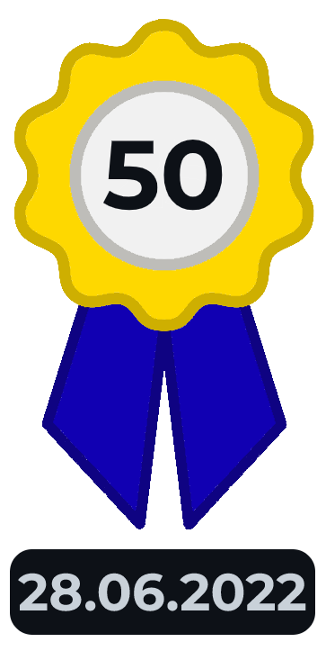
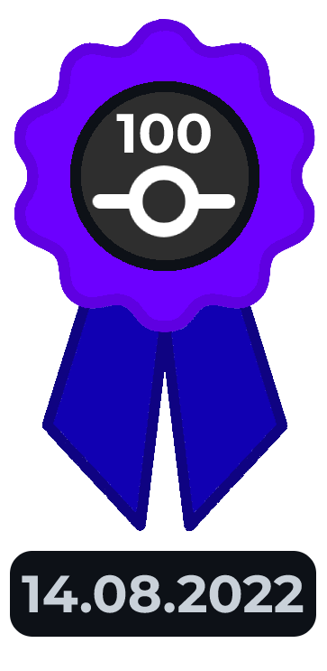

<p align=center>
    
</p>

<p align=center>
    <a href="https://apix0n.github.io/Armus/fr">
        
    </a>
    <a href="https://apix0n.github.io/Armus/en">
        
    </a>
    <a href="https://apix0n.github.io/Armus/tr">
        
    </a>
</p>

__🌹 Armus is a project hosted on GitHub, created with friends to organize all the custom amogi to make an army.__

* amogus, /aˈmoɡɪs, aˈmoɡus/ 
* plural: amogi, /aˈmoɡɪ/
* _noun_
* 1/ A crewmate or impostor character from the videogame Among Us.

## 🏅 Medals

<p align=center>
    
    
    
    
    
    
    
    
    
    
    
</p>

## ❓ How to see the characters?

Please go to https://apix0n.github.io/Armus or click on a website button in your language below the character.

## 📁 What are all those folders?

```
Armus
├── .github                     <--- GitHub files
│   └── ISSUE_TEMPLATE
├── en                          <--- Website in English
├── fr                          <--- Website in French
├── other
│   ├── achievements            <--- Medals (in .png)
│   ├── achievements-psd        <--- Medals (in .psd)
│   ├── buttons                 <--- Images of the buttons in the README (in .png)
│   ├── buttons-psd             <--- Images of the buttons in the README (in .psd)
│   ├── colored-psd             <--- Images for the PWA icons (in .psd)
│   └── creation-personnages    <--- Files for creating the characters
├── pics                        <--- Characters pics (in .jpeg)
└── tr                          <--- Website in Turkish
```

## ✨ Useful links
<p align=center>
    <a href="https://apix0n.github.io/Armus/en/#acknowledgements">
        
    </a>
    <a href="https://apix0n.github.io/Armus/en/#problem">
        
    </a>
</p>

## ℹ️ Other

* If you want to create a character, look at https://apix0n.github.io/Armus/en#character,
* If you want to do other modifications, look at https://apix0n.github.io/Armus/en#problem,
* If you want to reuse this project, mention my name and Armus' on the README and the website.

<details>
    <summary>Armus Alphabet</summary>

**Armus has characters that start with the letters:**

- [x] a 
- [x] b 
- [x] c 
- [x] d 
- [x] e 
- [x] f 
- [x] g 
- [x] h 
- [x] i 
- [x] j 
- [x] k 
- [x] l 
- [x] m 
- [x] n 
- [x] o 
- [x] p 
- [x] q 
- [x] r 
- [x] s 
- [x] t 
- [x] u 
- [x] v 
- [x] w 
- [x] x 
- [x] y 
- [x] z 

</details>

<details>
    <summary>Code to create a character</summary>

If you can't use `accm.sh`, edit the codes below. 

With an acknowledgement in the dedicated section: (+ golden name)
```html
<tr>
<td><a class="ref" href="#AN-[id-acknowledgements]">[charactername]</a></td>
<td><p></p></td>
<td><a href="pics/[charactername].jpeg"><span class="material-icons-round">link</span></a></td>
</tr>
```

Without an acknowledgement:
```html
<tr>
<td>[charactername]</td>
<td><p></p></td>
<td><a href="pics/[charactername].jpeg"><span class="material-icons-round">link</span></a></td>
</tr>
```
</details>    

### Made by [Apix](https://github.com/Apix0n) with ❤️ | 2022-2023