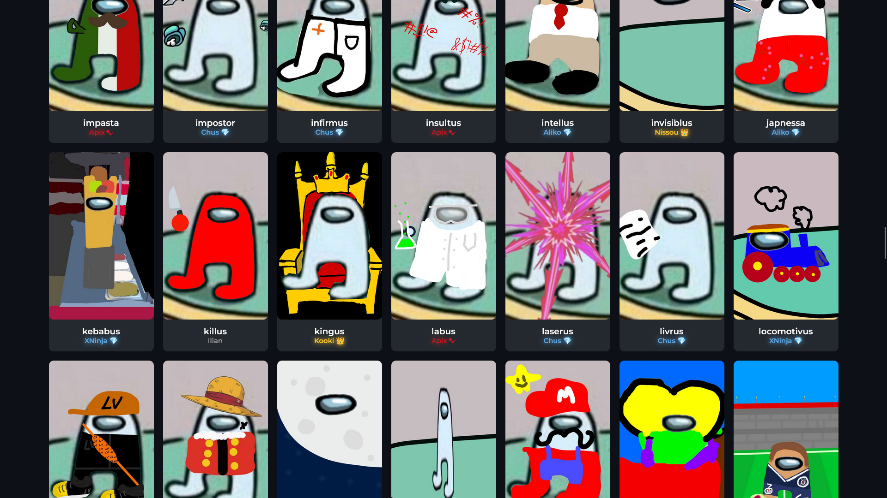
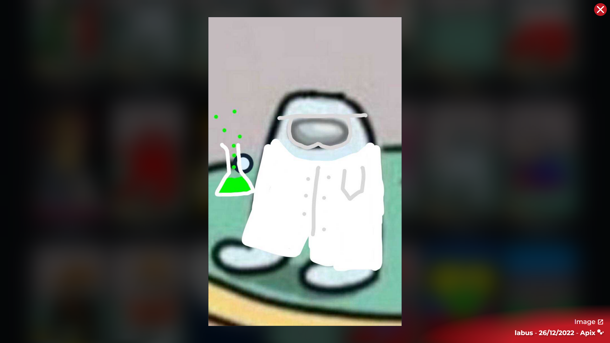
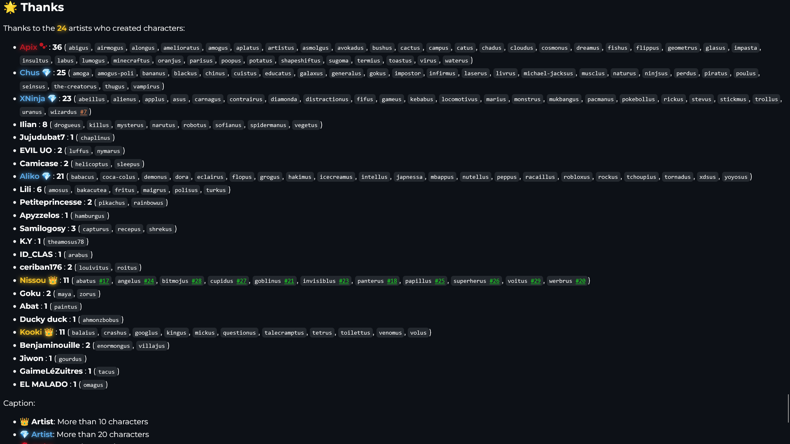

<p align=center>
    
</p>

<p align=center>
    <a href="https://apix0n.github.io/Armus/fr">
        
    </a>
    <a href="https://apix0n.github.io/Armus/en">
        
    </a>
    <a href="https://apix0n.github.io/Armus/tr">
        
    </a>
</p>

## 🌹 Armus is a project that I created with a friend in the hope to create an "army" of [amogi](#-definitions).

## 📕 Definitions

* **amogus** /aˈmoɡɪs, aˈmoɡus/
* *noun*
* 1/ An edited crewmate or impostor from the videogame Among Us.
* 2/ Misspelling/slang of the videogame Among Us. 

-----

* **amogi** /aˈmoɡɪ/
* *plural noun*
* 1/ Edited crewmates or impostors from the videogame Among Us.

## 🏅 Achievements

<p align="center">
  
  
  
  
  
  
  
  
  
  
  
  
  
  

</p>

## ❓ How to see the characters?

* Go to https://apix0n.github.io/Armus and select your preferred language,

**or**

* Below the icon on the top of the README, click on a button to go to your preferred language. 

## 📁 What are all those folders?

```
Armus
├── .github                     <--- GitHub files
│   └── ISSUE_TEMPLATE          <--- Issue templates
│
├── en                          <--- English version of the website
│   └── character               <--- Character guide in English
│
├── fr                          <--- French version of the website
│   └── character               <--- Character guide in French
│
├── other
│   ├── achievements            <--- Medals (.png)
│   ├── achievements-psd        <--- Medals (.psd)
│   ├── buttons                 <--- README buttons (.png)
│   ├── buttons-psd             <--- README buttons (.psd)
│   ├── create-a-character      <--- Resources to create the characters
│   └── icons-psd               <--- Icons (.psd)
│
├── pics                        <--- Images of the characters (.jpeg)
│
└── tr                          <--- Turkish version of the website
```

## 🎨 How to add a character

**Example with the character:** "termius"

* Open `/db.json`
  
* Gather the following informations:
  * The character's name **(required)**,
  * The artist's ID (if you don't know what I'm talking about, check "How to add an artist" below "How to add a character") **(required)**,
  * The image of the character **(required)**,
  * The date when the artist drew the character ***or*** when you're adding it **(required)**,
  * The GitHub "AddCharacter" issue number,
  * The GitHub "Idea" issue number,
  
* Find the place where the character will be (the characters need to be sorted alphabetically).
  > Here, the character's name is "termius", so it will be placed between "tchoupius" and "tetrus".
```json
"characters": [
    ...
  },
  {
    "name": "talecramptus",
    "artist": "Kooki",
    "image": "../pics/talecramptus.jpeg",
    "date": "04/07/2023"
  },
  {
    "name": "tchoupius",
    "artist": "Aliko",
    "image": "../pics/tchoupius.jpeg",
    "date": "29/06/2022"
  },
  // INDICATION: This is where the character will be placed. 
  {
    "name": "tetrus",
    "artist": "Kooki",
    "image": "../pics/tetrus.jpeg",
    "date": "05/04/2023"
  },
  {
    "name": "the-creatorus",
    "artist": "Chus",
    "image": "../pics/the-creatorus.jpeg",
    "date": "20/06/2022"
  },
  {
    ...
]
```
  
* Add the character in the right place to `db.json`.
```json
"characters": [
    ...
  },
  {
    "name": "talecramptus",
    "artist": "Kooki",
    "image": "../pics/talecramptus.jpeg",
    "date": "04/07/2023"
  },
  {
    "name": "tchoupius",
    "artist": "Aliko",
    "image": "../pics/tchoupius.jpeg",
    "date": "29/06/2022"
  },
  // INDICATION: These are the lines you are adding.
  {
    "name": "termius",  // Replace "termius" by the name of the character
    "artist": "Apix",   // Replace "Apix" by the ArtistID 
    "image": "../pics/termius.jpeg", // Replace by the path of the image
    "date": "04/07/2023" // Replace by the date when the artist drew the character or when you're adding it
  }, 
  // INDICATION: Don't forget to add the comma after the ending bracket.
  {
    "name": "tetrus",
    "artist": "Kooki",
    "image": "../pics/tetrus.jpeg",
    "date": "05/04/2023"
  },
  {
    "name": "the-creatorus",
    "artist": "Chus",
    "image": "../pics/the-creatorus.jpeg",
    "date": "20/06/2022"
  },
  {
    ...
]
```

* Save your changes.

* Verify that `/db.json` is valid using https://jsonlint.com.

## ✉ How to add an artist

**Example with the artist:** "EL MALADO"

* Open `/db.json`.

* Find the place where the artist should be (the artists are not sorted, add the artist after the last one).
```json
"artists": [
  ...
  },
  {
    "id": "Jiwon",
    "prettyname": "Jiwon",
    "rank": 0
  },
  {
    "id": "GaimeLeZuitres",
    "prettyname": "GaimeLéZuitres",
    "rank": 0
  } // INDICATION: The artist will be added after this bracket.
],
  ...
```

* Place the artist:
```json
"artists": [
  ...
  },
  {
    "id": "Jiwon",
    "prettyname": "Jiwon",
    "rank": 0
  },
  {
    "id": "GaimeLeZuitres",
    "prettyname": "GaimeLéZuitres",
    "rank": 0
  }, // INDICATION: Don't forget to add the comma after the ending bracket.
  { // INDICATION: These are the lines you are adding.
    "id": "EL-MALADO", // This is the ArtistID. Repalce it by a string which doesn't have special characters nor spaces (only hyphens are allowed).
    "prettyname": "EL MALADO", // Replace this by the name that will be shown on the website.
    "rank": 0 // This is the rank of the artist. See "Artist ranks" below for more informations.
  }
],
  ...
```

* Save your changes.

* Verify that `/db.json` is valid using https://jsonlint.com.

## 🌟 Artist ranks

There are currently **5** artist ranks in Armus. They add style and color to the website.

* `0`, no class, less than 10 characters, no emoji, no color.
* `1`, `.rank1`, from 10 to 19 characters, 👑, <span style="color: #ffca28; font-weight: 600; text-shadow: 0 0 10px;">golden</span> name for the artist. 
* `2`, `.rank2`, from 20 to 29 characters, 💎, <span style="color: #5dadec; font-weight: 600; text-shadow: 0 0 10px;">blue</span> name for the artist.
* `3`, `.rank3`, from 30 to 39 characters, 🌹, <span style="color: #be1923; font-weight: 600; text-shadow: 0 0 10px;">red</span> name for the artist.
* `4`, `.rank4`, from 40 to 49 characters, 🍀, <span style="color: #00d26a; font-weight: 600; text-shadow: 0 0 10px;">green</span> name for the artist.
* There is an exception for `Apix` that will not add an emoji but add the `Apix icon` instead.

<details>
  <summary>Where are the colors shown?</summary>

   
  *The ranks are shown in each character card, where each artist's name is colored and emoji'd according to their rank.*

  ---

  
  *The ranks are shown in the overlay when you tap/click on a charcter card. It colors the bottom right gradient, the close button and the name has the corresponding emoji.* 

  ---

  
  *The ranks are shown on the artist names. They are colored and the name has the corresponding emoji.*
</details>

## 📖 The Armus Alphabet

**Armus has characters that start with the letters:**

- [x] `A`, first character uploaded on **19/06/2022**
- [x] `B`, first character uploaded on **19/06/2022**
- [x] `C`, first character uploaded on **19/06/2022**
- [x] `D`, first character uploaded on **28/06/2022**
- [x] `E`, first character uploaded on **21/06/2022**
- [x] `F`, first character uploaded on **25/06/2022**
- [x] `G`, first character uploaded on **19/06/2022**
- [x] `H`, first character uploaded on **29/06/2022**
- [x] `I`, first character uploaded on **20/06/2022**
- [x] `J`, first character uploaded on **29/06/2022**
- [x] `K`, first character uploaded on **28/06/2022**
- [x] `L`, first character uploaded on **19/06/2022**
- [x] `M`, first character uploaded on **19/06/2022**
- [x] `N`, first character uploaded on **19/06/2022**
- [x] `O`, first character uploaded on **26/12/2022**
- [x] `P`, first character uploaded on **19/06/2022**
- [x] `Q`, first character uploaded on **12/11/2022**
- [x] `R`, first character uploaded on **28/06/2022**
- [x] `S`, first character uploaded on **19/06/2022**
- [x] `T`, first character uploaded on **20/06/2022**
- [x] `U`, first character uploaded on **29/06/2022**
- [x] `V`, first character uploaded on **19/06/2022**
- [x] `W`, first character uploaded on **22/06/2022**
- [x] `X`, first character uploaded on **29/06/2022**
- [x] `Y`, first character uploaded on **29/06/2022**
- [x] `Z`, first character uploaded on **12/11/2022**

## ✨ Useful links
<p align=center>
    <a href="https://apix0n.github.io/Armus/en/#acknowledgements">
        
    </a>
    <a href="https://apix0n.github.io/Armus/en/#problem">
        
    </a>
</p>

## ℹ️ Other

* If you want to create a character, look at https://apix0n.github.io/Armus/en/character,
* If you want to do other modifications, look at https://apix0n.github.io/Armus/en#problem,
* If you want to reuse this project, mention my name and Armus' on the README and the website.

<p xmlns:cc="http://creativecommons.org/ns#" xmlns:dct="http://purl.org/dc/terms/"><a property="dct:title" rel="cc:attributionURL" href="https://github.com/apix0n/Armus">Armus</a> by "<a rel="cc:attributionURL dct:creator" property="cc:attributionName" href="../en/#thanks">Apix and contributors</a>" is licensed under <a href="http://creativecommons.org/licenses/by-nc-sa/4.0/" target="_blank" rel="license noopener noreferrer" style="display:inline-block;">CC BY-NC-SA 4.0</a></p>

### [Made by Apix with ❤️ | 2022-2023](https://github.com/apix0n)